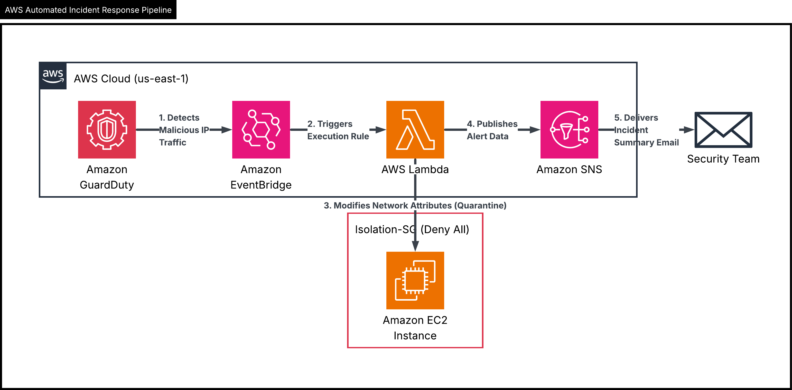
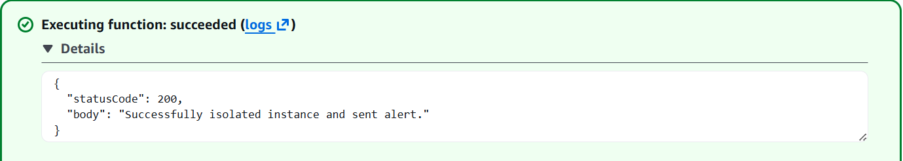
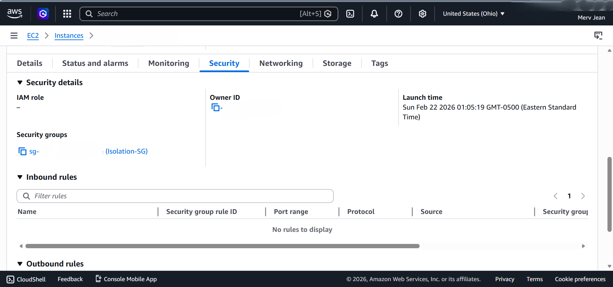
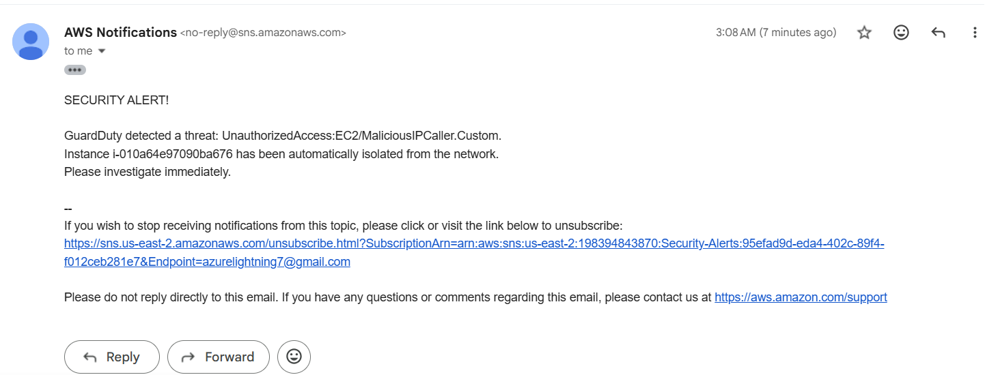

# AWS Automated Incident Response Pipeline Project

## Objective
This project builds an event-driven security pipeline to automatically detect and isolate compromised EC2 instances within a VPC. It demonstrates core cloud security principles, network automation, and Identity & Access Management (IAM) using AWS serverless technologies. By automating the containment phase, this architecture drastically reduces Mean Time To Respond (MTTR) from hours to seconds.

## Architecture
 

## Results & Validation
## Note
All sensitive information in the following screenshots (including AWS Account IDs, IAM ARNs, and personal email addresses) has been censored.

## Python Code Execution

## Isolated EC2 Instance

## SNS Email Alert

## Tools & Services Used
* **Amazon GuardDuty:** Continuous threat detection and malicious IP monitoring.
* **Amazon EventBridge:** Serverless event routing and alert filtering.
* **AWS Lambda:** Serverless compute to execute the Python containment script.
* **Amazon SNS:** Automated email paging for the incident response team.
* **AWS IAM:** Principle of least privilege role creation for Lambda execution.
* **Amazon EC2 & VPC Security Groups:** The target asset and stateful network firewalls used for dynamic quarantine.

## The Incident Response Workflow
1. **Detection:** GuardDuty monitors VPC flow logs and identifies an EC2 instance communicating with a known malicious IP address.
2. **Routing:** EventBridge intercepts the GuardDuty finding. If it matches our custom rule for EC2 network threats, it routes the payload to Lambda.
3. **Containment:** A Python script (via Boto3) extracts the Instance ID and immediately modifies the instance's network attributes, moving it into an empty "Isolation" Security Group that implicitly denies all inbound and outbound traffic.
4. **Notification:** Lambda publishes an alert to an SNS topic, sending an immediate email notification to the security team with the compromised Instance ID.

---

## Step-by-Step Guide

### Step 1: Prepare the Infrastructure (The Victim and the Jail)
*Launch Instance:* Launch a basic Amazon Linux EC2 instance. Use x86_64 architecture. Leave it in its default Security Group. Note the Instance ID.

Create Quarantine: Navigate to Security Groups and create a new one named Isolation-SG.

Crucial Step: Do not add any Inbound or Outbound rules. An empty Security Group acts as a quarantine by dropping all network connections. Note the Security Group ID.

### Step 2: Set Up Amazon SNS (The Pager)
Create Topic: In the SNS Dashboard, create a Standard topic named Security-Alerts.

Subscribe: Create a subscription, choose Email, and enter your email address.

Confirm: Check your inbox and click the Confirm subscription link. The status in AWS must change from Pending to Confirmed.

Note the Topic ARN: Ensure you copy the Topic ARN, not the Subscription ARN. Using the Subscription ARN will cause the Lambda to crash later with an Invalid parameter error.

### Step 3: Enable Amazon GuardDuty (The Sensor)
Enable Service: Navigate to the GuardDuty console. If it is not already active, click Get Started and then Enable GuardDuty.

Adjust Frequency: (Optional but Recommended) Go to Settings and change the Finding publishing frequency to 1 minute. This ensures your automated response triggers faster during the lab.

### Step 4: Create the IAM Role for Lambda
Create Role: In IAM, create a new role for the Lambda use case.

Attach Managed Policy: Search for and attach the AWSLambdaBasicExecutionRole policy.

Add Inline Policy: Once the role is created, click Add permissions > Create inline policy. Click the JSON tab and paste the code from policies/iam_role_policy.json in your repository.

Troubleshooting Tip: Ensure the JSON starts with "Version": "2012-10-17". If it starts with "source":, you are using the EventBridge JSON by mistake.

### Step 5: Deploy the Lambda Function (The Brain)
Create Function: Create a new Lambda function using Python 3.12 and the x86_64 architecture. Attach the IAM role from Step 4.

Paste Code: Paste the Python code located in src/lambda_function.py.

Environment Variables: Under Configuration -> Environment variables, add:

ISOLATION_SG_ID = [Your Security Group ID]

SNS_TOPIC_ARN = [Your SNS Topic ARN]

Troubleshooting Tip: Do not use quotation marks around the values in the AWS Console.

### Step 6: Configure EventBridge (The Dispatcher)
Create Rule: In EventBridge, create a new rule named GuardDuty-EC2-Malicious-IP. Select Rule with an event pattern.

Custom Pattern: Paste the JSON from policies/eventbridge_rule.json. This filters for UnauthorizedAccess:EC2/ and Trojan:EC2/ prefixes.

Set Target: Select Lambda function as the target and pick your incident response function.

### Step 7: Test the Pipeline (The Simulation)
Configure Test Event: In the Lambda console, click the Test tab. Select Create new event.

JSON Body: Paste the following JSON. Replace i-YOUR_REAL_INSTANCE_ID with your actual Instance ID (keep the double quotes):

JSON
{
  "detail": {
    "type": "UnauthorizedAccess:EC2/MaliciousIPCaller.Custom",
    "resource": {
      "instanceDetails": {
        "instanceId": "i-YOUR_REAL_INSTANCE_ID"
      }
    }
  }
}
Execution: Click Test. If successful, the execution summary will show a green Succeeded box.

### Step 8: Verification (The Proof)
Check Email: You should receive a Security-Alerts notification detailing the compromised Instance ID.

Check EC2 Security: Navigate to the EC2 Dashboard, select your instance, and click the Security tab. Verify the original Security Group has been removed and replaced entirely by the Isolation-SG.

### Step 9: Teardown and Clean Up (The Reset)
Terminate EC2: To avoid unwanted AWS billing, terminate the test instance.

Delete Resources: Delete the Isolation-SG, the EventBridge rule, the Lambda function, the IAM role, and the SNS Topic.

Disable GuardDuty: Navigate to GuardDuty > Settings and choose Disable or Suspend to stop finding generation.
